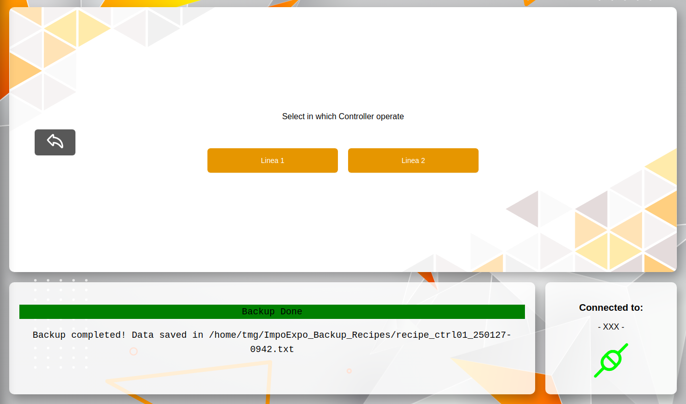

<p align="center">
  
</p>

<br>

#  ImpoExpo Recipes TMG 

ImpoExpo Recipes TMG è una web app creata da [TMG IMPIANTI S.p.A.](https://www.tmgimpianti.com/) per poter riuscire ad `esportare` (backup) e `importare` (restore) le ricette delle macchine tramite l'utilizzo del protocollo di comunicazione `OPC-UA`

<br>

## Installazione

1. **Avviare l' .exe -> `ImpoExpo Recipe TMG Setup [x.x.x].exe`**.
<p align="center">
    
</p>

2. **Verrà creata la cartella**:
   <br>`impoexpo-app`
   <br> che conterrà il file `.exe` e `l'unistaller`

3. **la cartella sarà situata nel seguente path**:
   ```bash
   C:\Users\[user]\AppData\Local\Programs\impoexpo-app
    ```
4. **In automatico verrà creato il collegamento su desktop**
<p align="center">
    
</p>


<br><br>


## Struttura dell'Applicazione
 **Main**
    <br>così è come si presenta l'applicazione
    <p align="center">
    
    </p>
    <br>**L'applicazione è suddivisa in 3 sezioni:**

1. **Menu Verticale**
    <br>Permette di scegliere le operazioni che si vogliono eseguire
    <p align="center">
    
    </p>

2. **Finestra principale**
    <br>Finestra nella quale verranno eseguite tutte le opertazioni
    <p align="center">
    
    </p>

1. **Messaggistica e stato connessione**
    <br> Qui verranno mostrati a video gli stati delle operazioni e lo stato di connessione alla macchina
    <p align="center">
    
    </p>


<br><br>


## Come funziona ?
1. **Avviare l'app `ImpoExpo Recipe TMG` sul desktop <br> o avviare l' .exe nella cartella**
    ```bash
   C:\Users\[user]\AppData\Local\Programs\impoexpo-app\ImpoExpo Recipe TMG.exe
    ```

2. **Si aprirà la pagina iniziale**:
    <p align="center">
    
    </p>
3. **Effetuare la connessione tramite OPC-UA**:
   ```
   Eseguire Login       ->  Tramite l'icona dell'utente in alto a destra o la sezione login in basso a sinistra

   Seleziona macchina   ->  Seleziona tramite il menu a tendina la macchina sulla quale connettersi
    ```
    Poi premi **`Connect`**
    <br><br>

4. **Connesso ?** :
    <br>Se la connessione andrà a buon fine comparirà un messaggio in verde che indichera la buona riuscirta della connessione e verrà indicato in basso a sinistra lo stato.
    > Connection Succeded at **opc.tcp://...**

    <p align="center">
    
    </p>
    Altrimenti verrà un messaggio di errore in rosso, in base al tipo di errore, con il suggerimento di cosa si ha sbagliato.

<br><br>

## Operazioni
<br>
<p align="center">
    
</p>

<br><br>

### EXPORT
Premere il pulsante `EXPORT`

>Si aprirà la pagina di scelta su quale controller operare

<p align="center">
    
</p>

> Una volta selezionato il controller sul quale operare si aprirà un `popUp di conferma`

se si confermerà si avvierà il processo di `esportazione` (backup) di tutte le ricette esistenti.<br>
Fino alla fine dell'operazione nello schermo sarà disabilitato qualsiasi altra possibilità di operazione. Lo schermo dell'applicazione diventerà più scuro e il puntatore del mouse sarà in caricamento.
> **NOTA:** ci sarà sempre in basso al centro i messaggi di stato di cosa sta processando l'applicazione
<p align="center">
    
</p>

Finita l'operazione di `esportazione` (backup) vi verrà chiesto dove salvare il file di esporazione:
1. **Path predefinito**:
    In automatico vi verrà mostrato il path predefinito dove salvare che è:
    ```bash
    C:\Users\[user]\ImpoExpo_Backup_Recipes
    ```

2. **Path personale**:
    volendo potete salvare il file in un'altra cartella dove meglio preferite 
<p align="center">
    
</p>

Salvato il file vi verrà mostrato nei messaggi l'intero path di salvataggio e vi comparirà l'alert di successo.
>Backup Done
<p align="center">
    
</p>

<br>

### RESTORE ALL
Premere il pulsante `RESTORE ALL` <br>
>Si aprirà la pagina di **RESTORE ALL**
<p align="center">
    
</p>

premete il pulsante **Scegli file** e scegliete il file che volete `importare` (restore) 
> Vi uscirà un PopUp per la scelta del file
1. **Path predefinito**:
    In automatico vi verrà aperto il path predefinito per scegliere il file che è:
    ```bash
    C:\Users\[user]\ImpoExpo_Backup_Recipes
    ```

2. **Path personale**:
    Volendo potete prendere il file in un'altra cartella a vostra scelta dove avete salvato il file in precedenza
<p align="center">
    
</p>

> **NOTA:** Una volta selezionato il file vi verrà mostrato sullo schermo il path completo del file

<p align="center">
    
</p>

Premere il pulsante di `Restore`
>Si aprirà un PopUP di conferma dell'azione

Procedere
<p align="center">
    
</p>

Una volta confermato si avvierà il processo di `importazione` (restore All) di tutte le ricette esistenti nel file selezionato.<br>
Fino alla fine dell'operazione nello schermo sarà disabilitato qualsiasi altra possibilità di operazione. Lo schermo dell'applicazione diventerà più scuro e il puntatore del mouse sarà in caricamento.
> **NOTA:** ci sarà sempre in basso al centro i messaggi di stato di cosa sta processando l'applicazione

una volta teminato il processo vi comparirà l'alert di successo con i suoi relativi messaggi

> All recipes restored!
<p align="center">
    
</p>

<br>

### RESTORE
selezionare il check su `RESTORE` e premere il pulsante `START` <br>
>Si aprirà la pagina di **RESTORE**
<p align="center">
    
</p>

premete il pulsante **Scegli file** e scegliete il file che volete `importare` (restore) 
> Vi uscirà un PopUp per la scelta del file
1. **Path predefinito**:
    In automatico vi verrà aperto il path predefinito per scegliere il file che è:
    ```bash
    C:\Users\[user]\ImpoExpo_Backup_Recipes
    ```

2. **Path personale**:
    Volendo potete prendere il file in un'altra cartella a vostra scelta dove avete salvato il file in precedenza
<p align="center">
    
</p>

> **NOTA:** Una volta selezionato il file vi verrà mostrato sullo schermo il path completo del file e le **ricette importabili**
```bash
    Possible number Recipe : 1,2,3...
```

<p align="center">
    
</p>

Selezionare il numero della ricetta che si vuole `importare` (Restore) <br>
e premere il pulsante di `Restore`
>Si aprirà un PopUP di conferma dell'azione

Procedere
<p align="center">
    
</p>

Una volta confermato si avvierà il processo di `importazione` (restore) del numero della ricetta selezionata del file selezionato.<br>
Fino alla fine dell'operazione nello schermo sarà disabilitato qualsiasi altra possibilità di operazione. Lo schermo dell'applicazione diventerà più scuro e il puntatore del mouse sarà in caricamento.
> **NOTA:** ci sarà sempre in basso al centro i messaggi di stato di cosa sta processando l'applicazione

una volta teminato il processo vi comparirà l'alert di successo con i suoi relativi messaggi

> Recipe [num] restored!
<p align="center">
    
</p>

<br>

## Pulsanti 
- ###  Menu
    1. Home
        <br>Ti riporta alla schermata di `Home`, anche quando sei sei connesso ad una macchina, disconnettendoti da quest'ultima.
    2. txt to Excel
        <br>Ti porta alla schermata di `txtToExcel`, anche quando sei sei connesso ad una macchina, disconnettendoti da quest'ultima.
    3. Settings
        <br>Ti porta alla schermata di `Settings`, anche quando sei sei connesso ad una macchina, disconnettendoti da quest'ultima.
    4. Help
        <br>Ti apre un PopUp che contiene informazioni sull'app e link utili per scoprire il funzionamento dell'app.
    5. Exit
        <br>Esce dall'applicazione.

- ###  Back
    Nelle schermate di `Backup`, `Restore` e `Restore All` ti permette di tornare indietro alla selezione dell'operazione da fare
    >è presente anche nelle pagine di `Settings` per tornare indietro

- ###  +   Login
    entrambe le selezioni fanno apparire il PopUIp di `Login`
    >  **NOTA:** nel trapezio in alto a destra verrà mostrato con che utente si è loggati

<br>

## Conversione file da txt to Excel

>Si aprirà la pagina dove sarà possibile inserire il file txt esportato e lo convertirà in un file excel dove i dati saranno più facili da leggere

<p align="center">
    
</p>

<br>


## Help
- `TMG` porta alla pagina web di TMG IMPIANTI S.p.A. per avere contatti
- `LICENSE` porta alla pagina dove viene mostato sotto che tipo di licenza è il software
- `README.MD` porta alla pagina dove viene mostato tutte le info e come si procende nell'utilizzo dell'app
<p align="center">

</p>

<br>

## Login
- `ADMIN` Può esesguire tutto
- `OPERATOR` Può fare tutto tranne andare nelle impostazioni (`Settings`)
<p align="center">

</p>

<br><br>

# Settings
### Login
effetuare il login come *`amministratore`* per effetuare la `configurazione`
    
<br>
    una volta effettuato con successo il login si aprira la pagina dove sarà possibile selezionare le opeazioni di configurazione

<br>

<p align="center">

</p>

<br>

### Import
Si aprirà la pagina di `Import` dove sarà possibile inportare un file di copnfigurazione .env
    
<br>

<p align="center">

</p>
    una volta effettuato con successo l'import si ritornerà al login con la configurazione nuova importata

<br>

### Manual
### First Time Config
Si aprirà la pagina di `Manual` dove sarà possibile iniziare da zero una configurazione

<br>

<p align="center">

</p>

<br>


<p align="center">

</p>

>una volta effettuato con successo la nuova configurazione si ritornerà al login per  attivare la nuova configurazione

<br>
<br>

## Config già esistente
Si aprirà la pagina di `Manual` dove sarà possibile modificare la configurazione attuale e  iniziare da zero una nuova aggiuntiva configurazione

<br>

<p align="center">

</p>

>una volta effettuato con successo la configurazione si ritornerà alla Home per attivare la nuova configurazione

<br>

### Save

salva le modifiche fatte o la nuova macchina creata

### Delete

Elimina la macchina selezionata o la nuova macchina che si sta creando

### Discard

Annulla le modifiche fatte sulla nuova macchina creata

<br>

### Export Cfg
>Si avvierà la funzione di `Export` dove sarà possibile esportare la configurazione in un file di configurazione .env 

<br>
    una volta effettuato con successo l'export vi verrà chiesto dove salvare il vostro file di configurazione esportato

<br>

### Delete Cfg
>Si avvierà la funzione di `Delete` dove sarà possibile eliminare la configurazione e ripartire da zero 

<br>
    una volta effettuato con successo l'eliminazione si ritornerà al login per attivare la modifica fatta
    
<br>
