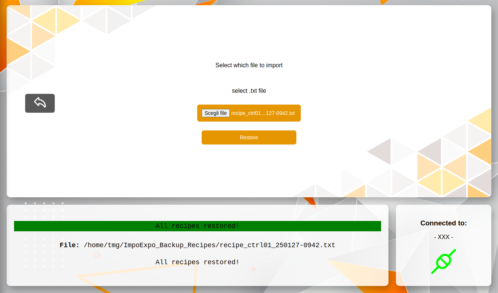
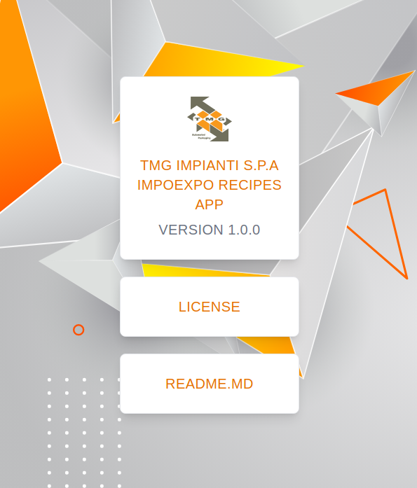

<p align="center">
  
</p>

<br>

#  ImpoExpo Recipes TMG 

ImpoExpo Recipes TMG è una web app creata da [TMG IMPIANTI S.p.A.](https://www.tmgimpianti.com/) per poter riuscire ad `esportare` (backup) e `importare` (restore) le ricette delle macchine tramite l'utilizzo del protocollo di comunicazione `OPC-UA`

<br>

## Installazione

1. **Avviare l' .exe -> `ImpoExpo Recipe TMG Setup [x.x.x].exe`**.
<p align="center">
    
</p>

2. **Verrà creata la cartella**:
   <br>`impoexpo-app`
   <br> che conterrà il file `.exe` e `l'unistaller`

3. **la cartella sarà situata nel seguente path**:
   ```bash
   C:\Users\[user]\AppData\Local\Programs\impoexpo-app
    ```
4. **In automatico verrà creato il collegamento su desktop**
<p align="center">
    
</p>

<br><br>

## Avvio Connessione
1. **Avviare l'app `ImpoExpo Recipe TMG` sul desktop <br> o avviare l' .exe nella cartella**
    ```bash
   C:\Users\[user]\AppData\Local\Programs\impoexpo-app\ImpoExpo Recipe TMG.exe
    ```

2. **Si aprirà la pagina iniziale**:
    <p align="center">
    
    </p>
3. **Effetuare la connessione tramite OPC-UA**:
   ```bash
   OPC-UA     ->   opc.tcp://[IP]:[Port]

   User       ->   Enabled User of OPCUA-Server

   Password   ->   Password of the enabled User
    ```
    Poi premi **`Connect`**

4. **Connesso ?** :
    <br>Se la connessione andrà a buon fine comparirà un messaggio in verde che indichera la buona riuscirta della connessione e il pallino di stato passerà da rosso a verde.
    > Connection Succeded at **opc.tcp://...**

    <p align="center">
    
    </p>
    Altrimenti verrà un messaggio di errore in rosso, in base al tipo di errore, con il suggerimento di cosa si ha sbagliatoin basso al centro.

<br>

## Operazioni
<br>
<p align="center">
    
</p>

<br>

### EXPORT
selezionare il check su `EXPORT` e premere il pulsante `START`

>Si aprirà un PopUP di conferma dell'azione

Procedere
<p align="center">
    
</p>

Una volta confermato si avvierà il processo di `esportazione` (backup) di tutte le ricette esistenti.<br>
Fino alla fine dell'operazione nello schermo sarà disabilitato qualsiasi altra possibilità di operazione. Lo schermo dell'applicazione diventerà più scuro e il puntatore del mouse sarà in caricamento.
> **NOTA:** ci sarà sempre in basso al centro i messaggi di stato di cosa sta processando l'applicazione
<p align="center">
    
</p>

Finita l'operazione di `esportazione` (backup) vi verrà chiesto dove salvare il file di esporazione:
1. **Path predefinito**:
    In automatico vi verrà mostrato il path predefinito dove salvare che è:
    ```bash
    C:\Users\[user]\ImpoExpo_Backup_Recipes
    ```

2. **Path personale**:
    volendo potete salvare il file in un'altra cartella dove meglio preferite 
<p align="center">
    
</p>

Salvato il file vi verrà mostrato nei messaggi l'intero path di salvataggio e vi comparirà l'artert di successo.
>Backup Done
<p align="center">
    
</p>

<br>

### RESTORE ALL
selezionare il check su `RESTORE ALL` e premere il pulsante `START` <br>
>Si aprirà la pagina di **RESTORE ALL**
<p align="center">
    
</p>

premete il pulsante **Scegli file** e scegliete il file che volete `importare` (restore) 
> Vi uscirà un PopUp per la scelta del file
1. **Path predefinito**:
    In automatico vi verrà aperto il path predefinito per scegliere il file che è:
    ```bash
    C:\Users\[user]\ImpoExpo_Backup_Recipes
    ```

2. **Path personale**:
    Volendo potete prendere il file in un'altra cartella a vostra scelta dove avete salvato il file in precedenza
<p align="center">
    
</p>

> **NOTA:** Una volta selezionato il file vi verrà mostrato sullo schermo il path completo del file

<p align="center">
    
</p>

Premere il pulsante di `Restore`
>Si aprirà un PopUP di conferma dell'azione

Procedere
<p align="center">
    
</p>

Una volta confermato si avvierà il processo di `importazione` (restore All) di tutte le ricette esistenti nel file selezionato.<br>
Fino alla fine dell'operazione nello schermo sarà disabilitato qualsiasi altra possibilità di operazione. Lo schermo dell'applicazione diventerà più scuro e il puntatore del mouse sarà in caricamento.
> **NOTA:** ci sarà sempre in basso al centro i messaggi di stato di cosa sta processando l'applicazione

una volta teminato il processo vi comparirà l'alert di successo con i suoi relativi messaggi

> All recipes restored!
<p align="center">
    
</p>

<br>

### RESTORE
selezionare il check su `RESTORE` e premere il pulsante `START` <br>
>Si aprirà la pagina di **RESTORE**
<p align="center">
    
</p>

premete il pulsante **Scegli file** e scegliete il file che volete `importare` (restore) 
> Vi uscirà un PopUp per la scelta del file
1. **Path predefinito**:
    In automatico vi verrà aperto il path predefinito per scegliere il file che è:
    ```bash
    C:\Users\[user]\ImpoExpo_Backup_Recipes
    ```

2. **Path personale**:
    Volendo potete prendere il file in un'altra cartella a vostra scelta dove avete salvato il file in precedenza
<p align="center">
    
</p>

> **NOTA:** Una volta selezionato il file vi verrà mostrato sullo schermo il path completo del file e le **ricette importabili**
```bash
    Possible number Recipe : 1,2,3...
```

<p align="center">
    
</p>

Selezionare il numero della ricetta che si vuole `importare` (Restore) <br>
e premere il pulsante di `Restore`
>Si aprirà un PopUP di conferma dell'azione

Procedere
<p align="center">
    
</p>

Una volta confermato si avvierà il processo di `importazione` (restore) del numero della ricetta selezionata del file selezionato.<br>
Fino alla fine dell'operazione nello schermo sarà disabilitato qualsiasi altra possibilità di operazione. Lo schermo dell'applicazione diventerà più scuro e il puntatore del mouse sarà in caricamento.
> **NOTA:** ci sarà sempre in basso al centro i messaggi di stato di cosa sta processando l'applicazione

una volta teminato il processo vi comparirà l'alert di successo con i suoi relativi messaggi

> Recipe [num] restored!
<p align="center">
    
</p>

<br>

## Pulsanti di Home & Back 
- ###  Home
    torna alla schermata di connessione e disconnette la connessione attuale (pallino di stato passa da verde a rosso)

- ###  Back
    Nelle schermate di `Restore` e `Restore All` ti permette di tornare indietro alla selezione dell'operazione da fare

<br>

## Menu
- ### File
    - #### Exit (uscire dall'applicazione)
- ### Help
    - #### About (piccolo PopUp con i minimi dati dell'applicazione)
    <p align="center">
    
    </p>
